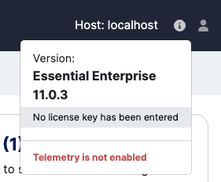

# MarkLogic Data Integration Training - Docker Guide

## Table of Contents

- [Prerequisites](#prerequisites)
- [Configure MarkLogic](#configure-marklogic)
- [Unit 1: Create customer360 database at port 8055](#unit-1-create-customer360-database-at-port-8055)
- [Unit 2: Loading and Indexing Data](#unit-2-loading-and-indexing-data)
- [Unit 3: Harmonizing Data](#unit-3-harmonizing-data)
- [Unit 4: Using Triples for Harmonization](#unit-4-using-triples-for-harmonization)
- [Unit 5: Using Templates for Data Extraction](#unit-5-using-templates-for-data-extraction)
- [Unit 6: Making SQL Queries](#unit-6-making-sql-queries)
- [Unit 7: Making Optic API Queries](#unit-7-making-optic-api-queries)
- [Unit 8: Modeling and Harmonizing through Entity Services](#unit-8-modeling-and-harmonizing-through-entity-services)

## Prerequisites
* **Docker Engine:** Ensure Docker Engine is installed and running on your system.
* **Docker Compose:** Verify that Docker Compose is installed and properly configured.
* **MarkLogic Developer License:** To use this official [MarkLogic Docker image](https://hub.docker.com/r/progressofficial/marklogic-db), you need to obtain a Developer License. Visit [MarkLogic Developer License](https://developer.marklogic.com/free-developer/) for detailed instructions on how to request a license.

## Configure MarkLogic

### Initial Setup
* Create secret files in the setup directory for MarkLogic credentials and licensing by running `bash ./setup.sh`.

* If you don’t have a developer license yet, comment out the following lines in docker-compose.yml:
  ```bash
  # - LICENSE_KEY_FILE=mldb_license_key
  # - LICENSEE_FILE=mldb_licensee
  ```

* Start the MarkLogic container:
  ```bash
  docker compose up
  ```

* Visit http://localhost:8001 and log in using admin credentials. Use the top-right menu to request a developer license.  


* Once you receive a license, update the following files with your license key and licensee details:  
[./setup/mldb_license_key.txt](/setup/mldb_license_key.txt)  
[./setup/mldb_licensee.txt](./setup/mldb_licensee.txt)  

* Uncomment the previously commented lines in docker-compose.yml
  ```bash
  - LICENSE_KEY_FILE=mldb_license_key
  - LICENSEE_FILE=mldb_licensee
  ```

* Restart the MarkLogic container:
  ```bash
  docker compose up -d
  ```
  ^ -d: run in the background without blocking your terminal.  

## Unit 1: Create customer360 database at port 8055

```bash
curl --anyauth --user admin:admin -X POST -d@"./mls-data-integration/unit01/customer360-config.json" -i -H "Content-type: application/json" http://localhost:8002/v1/rest-apis
```
^ This shows HTTP/1.1 401 Unauthorized first, followed by HTTP/1.1 201 Created. This is a normal part of the digest authentication process that MarkLogic implements to securely validate and authorize client requests.

## Unit 2: Loading and Indexing Data

### Exercise: Load Documents

MLCP Binary Command (Adjust Paths as Needed)
```bash
~/Desktop/mlcp/bin/mlcp.sh import -host localhost -port 8055 -username admin -password admin -mode local -input_file_path ~/Desktop/mls-data-integration/unit02/data/accounting-system -output_uri_replace "/home/cent/Desktop/mls-data-integration/unit02/data/accounting-system/,'/accounting/'" -output_collections "raw"
```
Equivalent Docker Command
```bash
docker run --rm --name mlcp-container -v ./mls-data-integration/unit02/data/accounting-system:/tmp/accounting-system devcodepantry/mlcp mlcp.sh import \
  -username admin \
  -password admin \
  -mode local \
  -host host.docker.internal \
  -port 8055 \
  -input_file_path /tmp/accounting-system \
  -output_uri_replace "/tmp/accounting-system,'/accounting'" \
  -output_collections "raw"
```

### Exercise: Split a Multiple-Record XML Document

MLCP Binary Command (Adjust Paths as Needed)
```bash
~/Desktop/mlcp/bin/mlcp.sh import -host localhost -port 8055 -username admin -password admin -mode local -input_file_path ~/Desktop/mls-data-integration/unit02/data/marketing-system/contacts.xml -input_file_type aggregates -aggregate_record_element contact -output_uri_prefix /marketing/contact- -uri_id id -output_uri_suffix .xml -output_collections "raw"
```

Equivalent Docker Command
```bash
docker run --rm --name mlcp-container -v ./mls-data-integration/unit02/data/marketing-system/contacts.xml:/tmp/contacts.xml devcodepantry/mlcp mlcp.sh import \
  -username admin \
  -password admin \
  -host host.docker.internal \
  -port 8055 \
  -mode local \
  -input_file_path /tmp/contacts.xml \
  -input_file_type aggregates \
  -aggregate_record_element contact \
  -output_uri_prefix /marketing/contact- \
  -uri_id id \
  -output_uri_suffix .xml \
  -output_collections "raw"
```

### Read the document using the MarkLogic REST API, through port 8055 

```bash
curl --anyauth --user admin:admin -X GET "http://localhost:8055/v1/documents?uri=/accounting/order-10072.json"
```

### Exercise: Load Records from a .csv File
MLCP Binary Command (Adjust Paths as Needed)
```bash
~/Desktop/mlcp/bin/mlcp.sh import -host localhost -port 8055 -username admin -password admin -mode local -input_file_path ~/Desktop/mls-data-integration/unit02/data/support-system/tech-support-calls_20170123.csv -input_file_type delimited_text -output_uri_prefix /tech-support/ -uri_id id -output_uri_suffix .json -document_type json -output_collections "raw,from_csv"
```

Equivalent Docker Command
```bash
docker run --rm --name mlcp-container -v ./mls-data-integration/unit02/data/support-system/tech-support-calls_20170123.csv:/tmp/tech-support-calls_20170123.csv devcodepantry/mlcp mlcp.sh import \
  -host host.docker.internal \
  -port 8055 \
  -username admin \
  -password admin \
  -mode local \
  -input_file_path /tmp/tech-support-calls_20170123.csv \
  -input_file_type delimited_text \
  -output_uri_prefix /tech-support/ \
  -uri_id id \
  -output_uri_suffix .json \
  -document_type json \
  -output_collections "raw,from_csv"
```

### Exercise: Transform Data While Loading (optional)
#### Load ex06_transformation_module.xqy module to `customer360-module` database
In Query Console(http://localhost:8000), select`customer360-module` database, Query Type: XQuery and run this.
```bash
xdmp:document-load("/tmp/mls-data-integration/unit02/ex06_transformation_module.xqy",
<options xmlns="xdmp:document-load">
  <uri>/ex06_transformation_module.xqy</uri>
</options>)
```
^ Refer to [Copy a Directory to a Docker Container](#copy-a-directory-to-a-docker-container) for instructions on copying a directory to your Docker container.

MLCP Binary Command (Adjust Paths as Needed)
```bash
~/Desktop/mlcp/bin/mlcp.sh import -mode local -host localhost -port 8055 -username admin -password admin -input_file_path ~/Desktop/mls-data-integration/unit02/ex06_input/ex06_doc.xml -transform_module /ex06_transformation_module.xqy -transform_namespace "http://marklogic.com/mlu/transform-date" -transform_param "value" -output_uri_replace "/home/cent/Desktop/mls-data-integration/unit02/ex06_input/,''"
```

Equivalent Docker Command
```bash
docker run --rm --name mlcp-container -v ./mls-data-integration/unit02/ex06_input/ex06_doc.xml:/tmp/ex06_doc.xml devcodepantry/mlcp mlcp.sh import \
  -host host.docker.internal \
  -port 8055 \
  -username admin \
  -password admin \
  -mode local \
  -input_file_path /tmp/ex06_doc.xml \
  -transform_module /ex06_transformation_module.xqy \
  -transform_namespace "http://marklogic.com/mlu/transform-date" \
  -transform_param "value" \
  -output_uri_replace "/tmp/,''"
```

### Load ex06_transformation_module.sjs module
In Query Console, create a new tab, select the `customer360-modules` database, select JavaScript for the Query Type, and run this (unit02/ex06_javascript_transformation/ex06_module_insert_javascript.txt):

```bash
'use strict';
declareUpdate();

xdmp.documentLoad('/tmp/mls-data-integration/unit02/ex06_javascript_transformation/ex06_transformation_module.sjs', {"uri": '/ex06_transformation_module.sjs'});
```
^ Refer to [Copy a Directory to a Docker Container](#copy-a-directory-to-a-docker-container) for instructions on copying a directory to your Docker container.

### Tramsform load using ex06_transformation_module.sjs module
MLCP Binary Command (Adjust Paths as Needed)
```bash
~/Desktop/mlcp/bin/mlcp.sh import -mode local -host localhost -port 8055 -username admin -password admin -input_file_path ~/Desktop/mls-data-integration/unit02/ex06_input_json/ex06_doc.json -transform_module /ex06_transformation_module.sjs -transform_function transformDate -document_type json -output_uri_replace "/home/cent/Desktop/mls-data-integration/unit02/ex06_input_json/,''"
```

Equivalent Docker Command
```bash
docker run --rm --name mlcp-container -v ./mls-data-integration/unit02/ex06_input_json/ex06_doc.json:/tmp/ex06_doc.json devcodepantry/mlcp mlcp.sh import \
  -host host.docker.internal \
  -port 8055 \
  -username admin \
  -password admin \
  -mode local \
  -input_file_path /tmp/ex06_doc.json \
  -transform_module /ex06_transformation_module.sjs \
  -transform_function transformDate \
  -document_type json \
  -output_uri_replace "/tmp/,''"
```

### Lab: Load Data
MLCP Binary Command (Adjust Paths as Needed)
```bash
~/Desktop/mlcp/bin/mlcp.sh import -host localhost -port 8055 -username admin -password admin -mode local -input_file_path ~/Desktop/mls-data-integration/unit02/data/sales-system/factsheets -output_uri_replace "/home/cent/Desktop/mls-data-integration/unit02/data/sales-system/factsheets,'/factsheet'" -output_collections "raw"
```

Equivalent Docker Command
```bash
docker run --rm --name mlcp-container -v ./mls-data-integration/unit02/data/sales-system/factsheets:/tmp/factsheets devcodepantry/mlcp mlcp.sh import \
  -host host.docker.internal \
  -port 8055 \
  -username admin \
  -password admin \
  -mode local \
  -input_file_path /tmp/factsheets \
  -output_uri_replace "/tmp/factsheets,'/factsheet'" \
  -output_collections "raw"
```

## Unit 3 Harmonizing Data

### Exercise: View Data to be Harmonized
MLCP Binary Command (Adjust Paths as Needed)
```bash
~/Desktop/mlcp/bin/mlcp.sh import -mode local -host localhost -port 8055 -username admin -password admin -input_file_path ~/Desktop/mls-data-integration/unit03/data -output_uri_replace "home/cent/Desktop/mls-data-integration/unit03/data,'marketing'" -output_collections "raw"
```

Equivalent Docker Command
```bash
docker run --rm --name mlcp-container -v ./mls-data-integration/unit03/data:/tmp/data devcodepantry/mlcp mlcp.sh import \
  -host host.docker.internal \
  -port 8055 \
  -username admin \
  -password admin \
  -mode local \
  -input_file_path /tmp/data \
  -output_uri_replace "tmp/data,'marketing'" -output_collections "raw"
```

### Exercise: Use CoRB for a Batch Process
Refer to the instructions in [./corb-docker/README.md](./corb-docker/README.md)

### Exercise: Use the Data Movement SDK for a Batch Process
Skip

### Lab: Add Canonical Data
Refer to the instructions in [./corb-docker/README.md](./corb-docker/README.md)

## Unit 4 Using Triples for Harmonization
MLCP Binary Command (Adjust Paths as Needed)
```bash
~/Desktop/mlcp/bin/mlcp.sh import -mode local -host localhost -port 8055 -username admin -password admin -input_file_path ~/Desktop/mls-data-integration/unit04/triples.nt -input_file_type RDF -output_uri_prefix /triplestore/
```

Equivalent Docker Command
```bash
docker run --rm --name mlcp-container -v ./mls-data-integration/unit04/triples.nt:/tmp/triples.nt devcodepantry/mlcp mlcp.sh import \
  -host host.docker.internal \
  -port 8055 \
  -username admin \
  -password admin \
  -mode local \
  -input_file_path /tmp/triples.nt \
  -input_file_type RDF \
  -output_uri_prefix /triplestore/
```

In Query Console, create a new tab, select `JavaScript` for the Query Type, and enter the following to load the citycruiser.json document in the `customer360` database, including its embedded triples (ex02b.txt):
```bash
'use strict';
declareUpdate(); 

xdmp.documentLoad('/tmp/mls-data-integration/unit04/citycruiser.json', {'uri': '/factsheet/citycruiser.json', 'collections': ['raw']})
```

## Unit 5 Using Templates for Data Extraction
## Unit 6 Making SQL Queries
## Unit 7 Making Optic API Queries
## Unit 8 Modeling and Harmonizing through Entity Services


## Docker Tips
### Copy a Directory to a Docker Container
To copy the ./mls-data-integration directory to the /tmp/ directory inside the MarkLogic container, use the following command:
```bash
docker cp ./mls-data-integration marklogic-training:/tmp
```
^ If the copy command results in an error, restarting the Docker container may resolve the issue.  

Once copied, the mls-data-integration directory will be located at `/tmp/mls-data-integration` inside your MarkLogic container. To verify its existence, check if `/tmp/mls-data-integration` exists in the MarkLogic container:
```bash
docker exec marklogic-training ls -l /tmp/mls-data-integration
```
^ Be aware that MarkLogic may clear its contents in `/tmp` at some point. If this happens, you may need to copy the files again.

#### Using the Directory in Query Console
When loading a file in the Query Console, replace any reference to:
`/home/cent/Desktop/mls-data-integration/`
with:
`/tmp/mls-data-integration/`

This ensures the correct file path is used within the container.

## Copyright Notice

The MarkLogic Docker image and training resources provided in this repository are the property of **MarkLogic, a Progress Software company**. 

For more information, please refer to the official website: [https://www.progress.com/marklogic](https://www.progress.com/marklogic)

